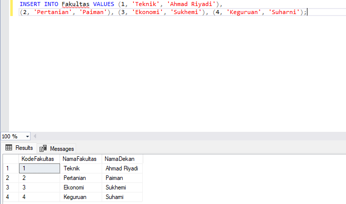
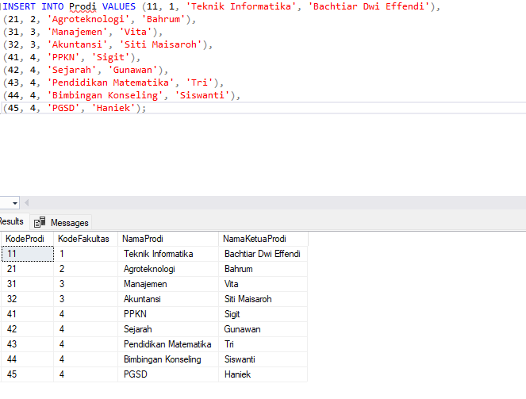
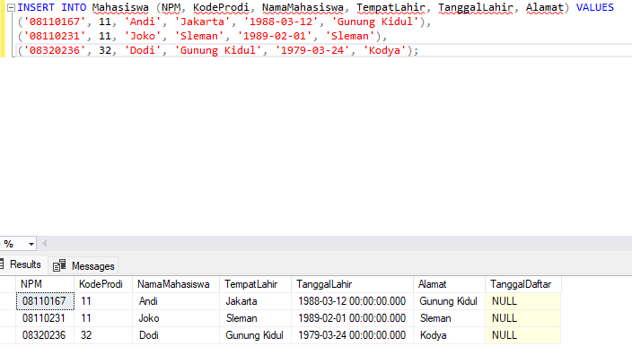
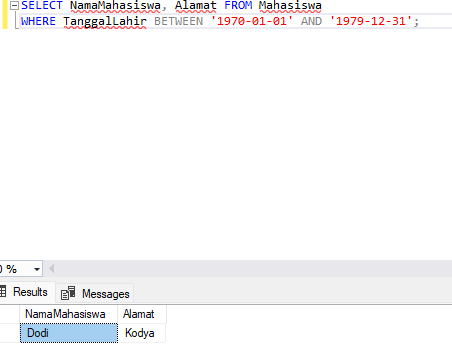
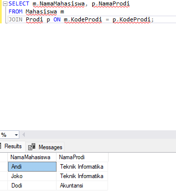
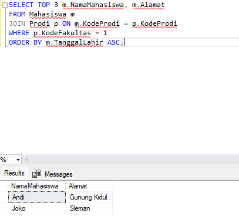
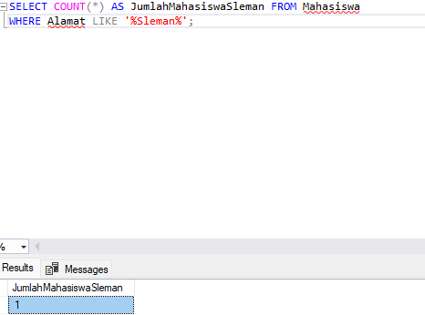
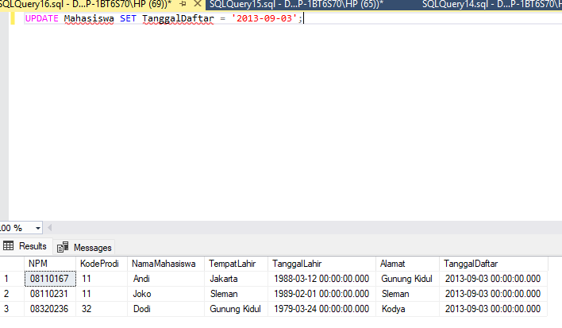
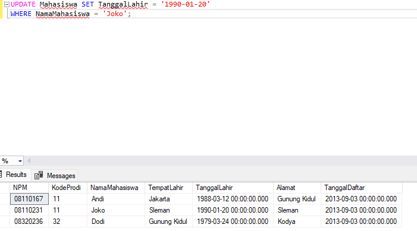
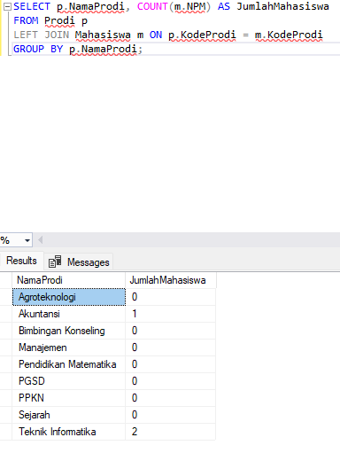

# Laporan Pengerjaan Task 3: Kueri Database SQL Server

File ini berisi seluruh jawaban kueri SQL untuk pengelolaan database kependidikan (Fakultas, Prodi, dan Mahasiswa) sesuai dengan instruksi pengerjaan.

## Jawaban Kueri SQL (Nomor 1 - 15)

### 1. Pembuatan Struktur Tabel
```sql
-- 1. Buat Tabel Fakultas
CREATE TABLE Fakultas (
    KodeFakultas INT, 
    NamaFakultas VARCHAR(30), 
    NamaDekan VARCHAR(50)
);

-- 2. Buat Tabel Prodi
CREATE TABLE Prodi (
    KodeProdi INT, 
    KodeFakultas INT, 
    NamaProdi VARCHAR(30), 
    NamaKetuaProdi VARCHAR(50)
);

-- 3. Buat Tabel Mahasiswa
CREATE TABLE Mahasiswa (
    NPM VARCHAR(8), 
    KodeProdi INT, 
    NamaMahasiswa VARCHAR(50), 
    TempatLahir VARCHAR(30), 
    TanggalLahir DATETIME, 
    Alamat VARCHAR(100)
);


-- 4. Menentukan Primary Key pada Tabel Fakultas
ALTER TABLE Fakultas ADD CONSTRAINT PK_Fakultas PRIMARY KEY (KodeFakultas);

-- 5. Menentukan Composite Primary Key pada Tabel Prodi
ALTER TABLE Prodi ADD CONSTRAINT PK_Prodi PRIMARY KEY (KodeProdi, KodeFakultas);

-- 6a. Data Fakultas
INSERT INTO Fakultas VALUES (1, 'Teknik', 'Ahmad Riyadi'), (2, 'Pertanian', 'Paiman'), (3, 'Ekonomi', 'Sukhemi'), (4, 'Keguruan', 'Suharni');



-- 6b. Data Prodi
INSERT INTO Prodi VALUES (11, 1, 'Teknik Informatika', 'Bachtiar Dwi Effendi'), (21, 2, 'Agroteknologi', 'Bahrum'), (31, 3, 'Manajemen', 'Vita'), (32, 3, 'Akuntansi', 'Siti Maisaroh'), (41, 4, 'PPKN', 'Sigit'), (42, 4, 'Sejarah', 'Gunawan'), (43, 4, 'Pendidikan Matematika', 'Tri'), (44, 4, 'Bimbingan Konseling', 'Siswanti'), (45, 4, 'PGSD', 'Haniek');



-- 6c. Contoh Data Mahasiswa Utama
INSERT INTO Mahasiswa (NPM, KodeProdi, NamaMahasiswa, TempatLahir, TanggalLahir, Alamat) VALUES 
('08110167', 11, 'Andi', 'Jakarta', '1988-03-12', 'Gunung Kidul'),
('08110231', 11, 'Joko', 'Sleman', '1989-02-01', 'Sleman'),
('08320236', 32, 'Dodi', 'Gunung Kidul', '1979-03-24', 'Kodya');

-- 7. Menambah Kolom TanggalDaftar
ALTER TABLE Mahasiswa ADD TanggalDaftar DATETIME;



-- 8. Menampilkan Mahasiswa kelahiran tahun 70-an
SELECT NamaMahasiswa, Alamat FROM Mahasiswa 
WHERE TanggalLahir BETWEEN '1970-01-01' AND '1979-12-31';



-- 9. Menampilkan Nama Mahasiswa dan Nama Prodinya
SELECT m.NamaMahasiswa, p.NamaProdi 
FROM Mahasiswa m 
JOIN Prodi p ON m.KodeProdi = p.KodeProdi;



-- 10. Menampilkan 3 Mahasiswa tertua dari Fakultas Teknik (KodeFakultas = 1)
SELECT TOP 3 m.NamaMahasiswa, m.Alamat 
FROM Mahasiswa m 
JOIN Prodi p ON m.KodeProdi = p.KodeProdi 
WHERE p.KodeFakultas = 1 
ORDER BY m.TanggalLahir ASC;



-- 11. Menampilkan jumlah Mahasiswa yang beralamat di Sleman
SELECT COUNT(*) AS JumlahMahasiswaSleman FROM Mahasiswa 
WHERE Alamat LIKE '%Sleman%';



-- 12. Update TanggalDaftar untuk seluruh Mahasiswa
UPDATE Mahasiswa SET TanggalDaftar = '2013-09-03';



-- 13. Menampilkan Mahasiswa dengan nama awalan 'D'
SELECT * FROM Mahasiswa WHERE NamaMahasiswa LIKE 'D%';


-- 14. Update TanggalLahir Mahasiswa bernama Joko
UPDATE Mahasiswa SET TanggalLahir = '1990-01-20' 
WHERE NamaMahasiswa = 'Joko';



-- 15. Menampilkan Nama Prodi dan jumlah Mahasiswanya
SELECT p.NamaProdi, COUNT(m.NPM) AS JumlahMahasiswa 
FROM Prodi p 
LEFT JOIN Mahasiswa m ON p.KodeProdi = m.KodeProdi 
GROUP BY p.NamaProdi;

